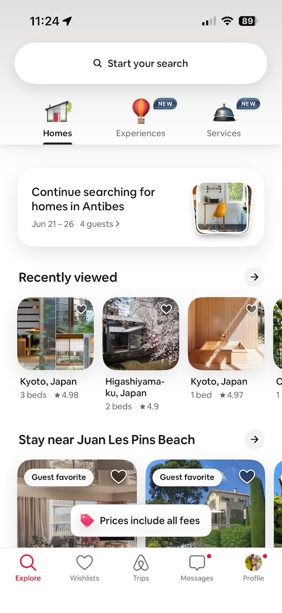
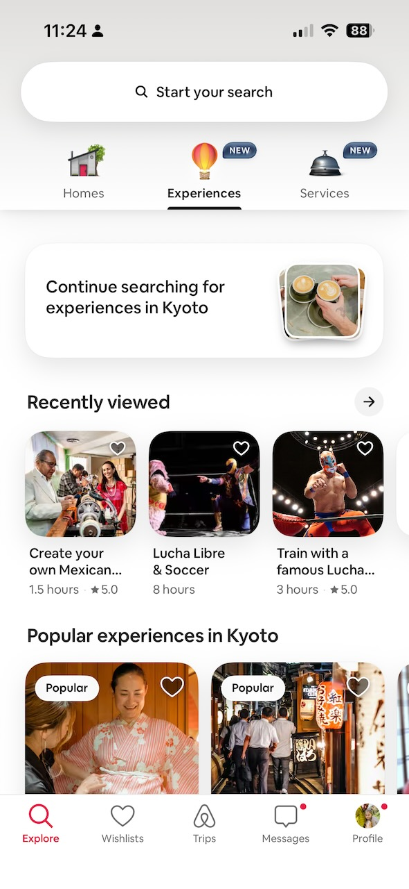
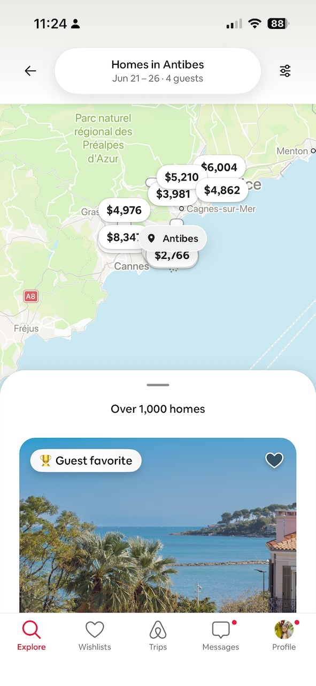
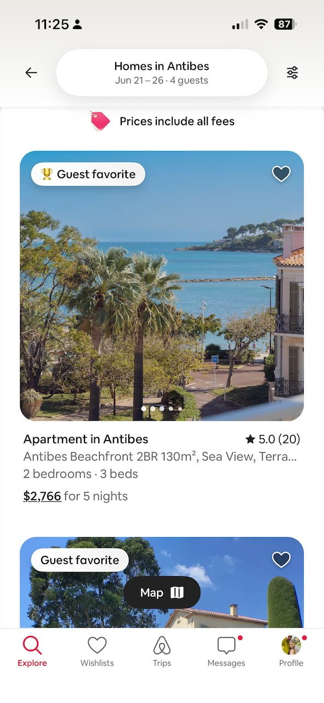
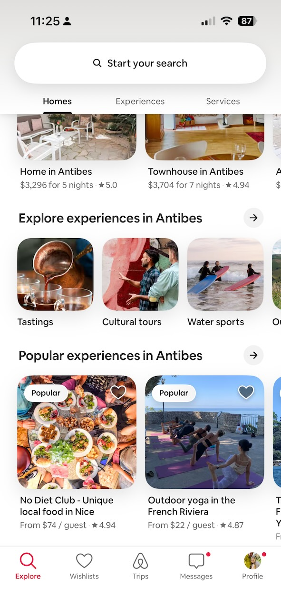

# Trip Curator 2.0 — Mobile

Upload a photo, get back a constraint-solved Airbnb trip — stays, experiences, services — rendered in Airbnb's mobile design language.

Sibling project to `../trip-curator/` (1.0). Shares the same engine — image analysis, constraint solver, mock data — but rebuilds the entire surface for mobile-first Airbnb fidelity.

## What's different from 1.0

The engine is **mostly shared** — same constraint solver shape, same Anthropic API integration, same mock data files. The trip composition has changed: where 1.0 returned `{stay, experience, service}`, 2.0 returns `{stay, experiences[], service}` with the renderer surfacing 1, 2, or 3 experiences depending on duration (services always stay, always render last).

The **surface is completely rebuilt** for mobile-first Airbnb fidelity:
- Inter (Cereal substitute) replacing IBM Plex Mono / Barlow Condensed
- Rausch (`#FF385C`) replacing the ECAL accent (`#E8280A`)
- Rounded cards (8/12/16/24px radii) replacing sharp 0px corners
- Single-column mobile layout with sticky bottom CTAs
- Non-functional Airbnb bottom tab bar across all screens (visual only — only the Trips tab is wired up)
- Floating + button on the Trips tab opens system photo picker
- Airbnb-style price-bubble pins on the map (Rausch for stays, white for everything else)
- Detail pages converted from desktop two-column to mobile single-column
- **One trip per scrolling page** at `/results/[index]` — replaces 1.0's stacked feed; "See another trip →" cycles through the three trips
- **Duration drives experience count**: 2–4 nights → 1 experience, 5–7 → 2, 8–10 → 3

## Quick start

```bash
cd trip-curator-mobile
npm install
cp .env.example .env.local
# Add ANTHROPIC_API_KEY to .env.local
npm run dev
```

Open http://localhost:3000 — best viewed in mobile DevTools view (cmd-shift-M in Chrome). On desktop, the canvas centers as a 430px-wide phone frame.

## Project structure

```
src/
├── pages/
│   ├── _app.tsx              ← imports globals
│   ├── index.tsx             ← Trips tab + FAB upload
│   ├── results/[index].tsx   ← One trip per page; nights persist via ?n= query
│   ├── api/analyze.ts        ← Claude prompt — returns 3 ranked experiences per trip
│   ├── stay/[id].tsx         ← (unchanged JSX, new mobile CSS)
│   ├── experience/[id].tsx   ← (unchanged JSX, new mobile CSS)
│   └── service/[id].tsx      ← (unchanged JSX, new mobile CSS)
├── components/
│   ├── TabBar.tsx            ← non-functional Airbnb bottom nav (visual only)
│   ├── TripCard.tsx          ← new mobile card
│   ├── DurationStepper.tsx   ← + / − stepper instead of slider
│   └── MapWidget.tsx         ← Airbnb price-bubble pins
├── lib/
│   ├── types.ts              ← TripOption now has experiences[]; experienceCountForNights helper
│   ├── utils.ts              ← assembleTrips + curateTripOptions emit 1–3 experiences per trip
│   └── regions.ts            ← (unchanged from 1.0)
└── styles/
    ├── globals.css           ← Airbnb design tokens
    ├── Home.module.css
    ├── Results.module.css
    ├── TripCard.module.css
    ├── TabBar.module.css
    ├── DurationStepper.module.css
    ├── MapWidget.module.css
    └── StayDetail.module.css ← shared by all three detail pages
```

## Design tokens

All in `src/styles/globals.css` as CSS variables:
- `--color-rausch`: `#FF385C`
- `--color-text` / `--color-text-secondary` / `--color-text-tertiary`
- `--color-divider` / `--color-border`
- `--color-surface` / `--color-surface-alt` / `--color-surface-tint`
- `--font-sans`: Inter family
- `--fs-display` through `--fs-tiny`: type scale
- `--sp-1` through `--sp-10`: 4-point grid
- `--r-sm` through `--r-pill`: radius scale
- `--shadow-sm` / `--shadow-md` / `--shadow-card` / `--shadow-fab`

## Design references

Reference screenshots from the real Airbnb mobile app live in [`docs/airbnb-reference/`](docs/airbnb-reference/). They're the fidelity target for typography, color, spacing, and component shape.

### Browse and discover

<p>
  
  
</p>

Drives the Trips-tab landing surface: three-category tab strip (Homes / Experiences / Services), the "Continue searching" prompt card, the "Recently viewed" horizontal scroll of rounded image cards with floating heart toggles, and the bottom tab bar.

### Search results — map and list

<p>
  
  
  
</p>

Drives the trip results feed and detail pages: white price-bubble pins (with one tinted "selected" state), the "Guest favorite" trophy badge, the listing-card stack (image carousel → title → subtitle → bed count → underlined total price), the "Prices include all fees" tag, the floating "Map" toggle pill, and the inline category chip row ("Tastings / Cultural tours / Water sports").

**Important:** trip-curator-mobile builds flows that real Airbnb does not have — photo-driven trip generation, single-prompt itinerary results that bundle stays + experiences + services into one trip feed. For those screens there is no 1:1 reference; we extrapolate from these adjacent patterns and make educated guesses about how Airbnb *would* design them. Treat the references as a style bible, not a spec.

## Known gaps for v2.0

- The Reserve buttons don't open a real booking sheet (they're visual placeholders)
- The "share" icon on results is decorative
- Tab bar items other than Trips don't navigate
- The heart save state on trip cards isn't persisted

These are all intentionally deferred for a fast POC. The engine + surface are working end-to-end.
